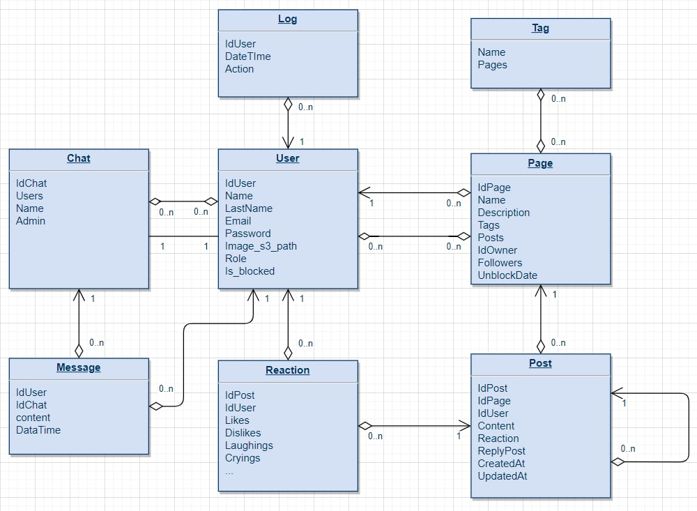

## Mininmal requirements:
* User's role:
  * default
  * moderatore
  * admin
---
* Default user:
  * authentification
  * create, redact and del a page
  * add and del the tags in a page
  * subscribe a page
  * write, del the posts
  * add the emotions as a reaction
---
* Moderatore:
  * ban any page for the time
  * del any posts
---
* Admin:
  * as the moderatore + ban any user

---
DB scheme:

---
DB description:

___Highlighted___ fields are primary keys or part of them

* User
all users, who may use app
  * ___IdUser___ - uuid (universal unical identifier)
  * Name - text (an user name of the variable length)
  * LastName - text (an user lastname of the variable length)
  * Email - text (an user email of the variable length)
  * Password - text (an user password of the variable length)
  * Image_s3_path - text (an user avatar image path of the  variable length)
  * Role - text (an user role of the variable length, cases: user, moderatore, admin)
  * Is_blocked - bool (is user banned or not)
  
* Log
logs for user actions
  * ___IdUser___ - uuid (foriegn key)
  * DateTime - time (time of action)
  * Action - text (an user action for log)
  
* Chat
chat for communication with users
  * ___IdChat___ - uuid
  * Name - text (a chat name)
  * Admin - uuid (IdUser, one to one chat admin)
  
* ChatUser
many to many table
  * ___IdChat___ - uuid (foriegn key)
  * ___IdUser___ - uuid (foriegn key)
  
* Message
user message in a chat
  * ___IdChat___ - uuid (foriegn key)
  * ___IdUser___ - uuid (foriegn key)
  * content - text (message content)
  * DataTime - time (message sending time)
  
* Page
User's page with own posts and tags
  * ___IdPage___ - uuid
  * Name - text (page name)
  * Description - text (description of the page)
  * IdOwner - uuid (foriegn key)
  * UnblockDate - time (when would be unbanned)
  
* Followers
many to many table betweeb users and pages
  * ___IdPage___ - uuid (foriegn key)
  * ___IdUser___ - uuid (foriegn key)
  
* Tag
tag to find and group pages
  * ___Name___ - text (tag name)
  
* PageTag
many to many table
  * ___IdPage___ - uuid (foriegn key)
  * ___Name___ - text (foriegn key, tag name)
  
* Post
content of the page, may reply other posts
  * ___IdPost___ - uuid
  * IdPage - uuid (foriegn key)
  * IdUser - uuid (foriegn key)
  * Content - text (post content)
  * ReplyPostId - uuid (foreign key for reply post)
  * CreatedAt - time (when created)
  * UpdatedAt - time (when updated)
  
* Reaction
reaction for the post, user may set some different for posts
  * ___IdPost___ - uuid (foreign key)
  * ___IdUser___ - uuid (foreign key)
  * Likes - bool
  * Dislikes - bool
  ..
---
Completed and normalized DB:

